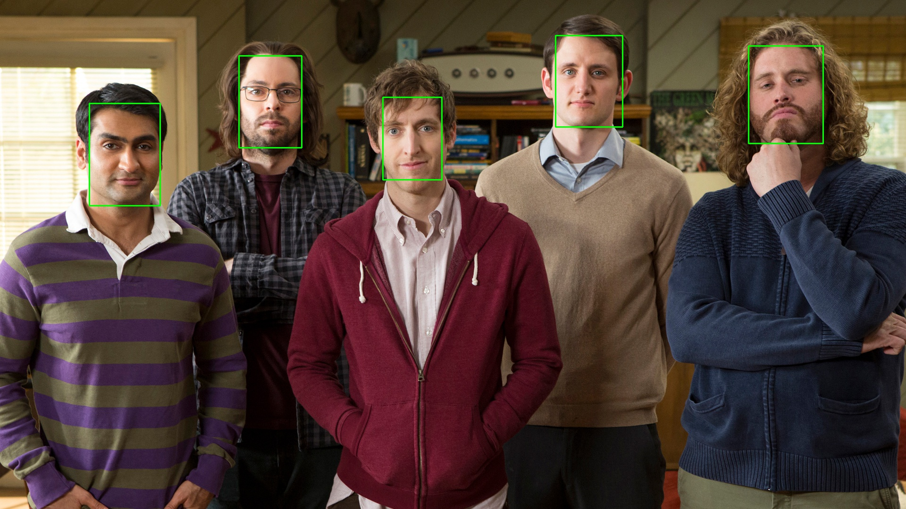
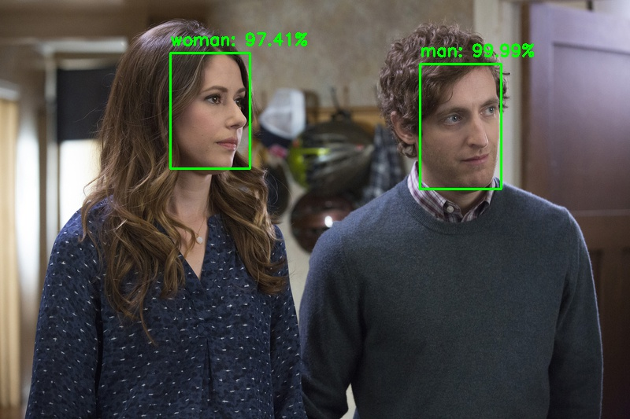
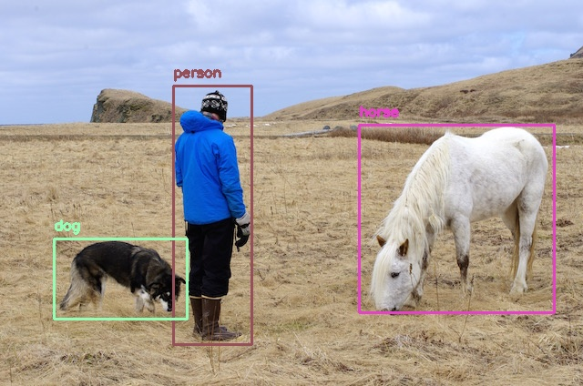

[](http://pepy.tech/project/cvlib)  [](https://gitter.im/arunponnusamy/cvlib?utm_source=badge&utm_medium=badge&utm_campaign=pr-badge)

# cvlib 
A high level easy-to-use open source Computer Vision library for Python.

## Installation
Provided the below python packages are installed, cvlib is completely pip installable.
* numpy 
* opencv-python 
* requests
* progressbar
* pillow
* tensorflow
* keras

Install the required packages using the below command

`pip install -r requirements.txt`

`pip install cvlib`

To upgrade to the newest version
`pip install --upgrade cvlib`

If you are using a GPU, edit the `requirements.txt` file to install `tensorflow-gpu` instead of `tensorflow`.

**Note: Compatability with Python 2.x is not officially tested.** 

## Face detection
Detecting faces in an image is as simple as just calling the function `detect_face()`. It will return the bounding box corners and corresponding confidence for all the faces detected.
### Example :

``` 
import cvlib as cv
faces, confidences = cv.detect_face(image) 
```
Seriously, that's all it takes to do face detection with `cvlib`. Underneath it is using OpenCV's `dnn` module with a pre-trained caffemodel to detect faces. 

Checkout `face_detection.py` in `examples` directory for the complete code. 

### Sample output :



## Gender detection
Once face is detected, it can be passed on to `detect_gender()` function to recognize gender. It will return the labels (man, woman) and associated probabilities. 

### Example

`label, confidence = cv.detect_gender(face) `

Underneath `cvlib` is using a [pre-trained](https://github.com/arunponnusamy/gender-detection-keras) keras model to detect gender from face. The accuracy is not so great at this point. It still makes mistakes. Working on adding a more accurate model. 

Checkout `gender_detection.py` in `examples` directory for the complete code. 

### Sample output :



## Object detection
Detecting common objects in the scene is enabled through a single function call `detect_common_objects()`. It will return the bounding box co-ordinates, corrensponding labels and confidence scores for the detected objects in the image.

### Example :

``` 
import cvlib as cv
from cvlib.object_detection import draw_bbox

bbox, label, conf = cv.detect_common_objects(img)

output_image = draw_bbox(img, bbox, label, conf)
```
Underneath it uses [YOLOv3](https://pjreddie.com/darknet/yolo/) model trained on [COCO dataset](http://cocodataset.org/) capable of detecting 80 [common objects](https://github.com/arunponnusamy/object-detection-opencv/blob/master/yolov3.txt) in context.

Checkout `object_detection.py` in `examples` directory for the complete code. 

### Real time object detection
`YOLOv3` is actually a heavy model to run on CPU. If you are working with real time webcam / video feed and doesn't have GPU, try using `tiny yolo` which is a smaller version of the original YOLO model. It's significantly fast but less accurate. 

```
bbox, label, conf = cv.detect_common_objects(img, confidence=0.25, model='yolov3-tiny')
```
Check out the [example](examples/object_detection_webcam_yolov3_tiny.py) to learn more.

### Sample output :



## License
cvlib is released under MIT license.
